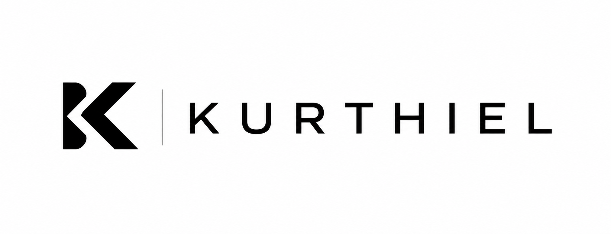

  

<h1 align="center">Kurthiel</h1>

Building practical AI systems, automation workflows, and business tools.

## 👋 About

Kurthiel is an AI-focused brand dedicated to helping businesses work smarter through practical automation, intelligent workflows, and well-designed business systems.

The goal is simple:
- Save businesses time
- Improve productivity
- Build practical AI solutions
- Create systems people actually enjoy using

## 🚀 Current Focus
- Artificial Intelligence
- Workflow Automation
- Prompt Engineering
- Business Documentation
- Productivity Systems
- Technical Research

## 📂 Current Projects
- AI Portfolio
- Business Research Reports
- Prompt Library
- Automation Workflows
- Documentation Templates

## 🌱 Currently Learning
- Python
- Git & GitHub
- n8n
- AI APIs
- Machine Learning Fundamentals

## 🎯 Mission
Building reliable AI tools that solve real business problems.

## 📫 Contact
📧 hello.kurthiel@gmail.com

---

> Building one useful project at a time.
